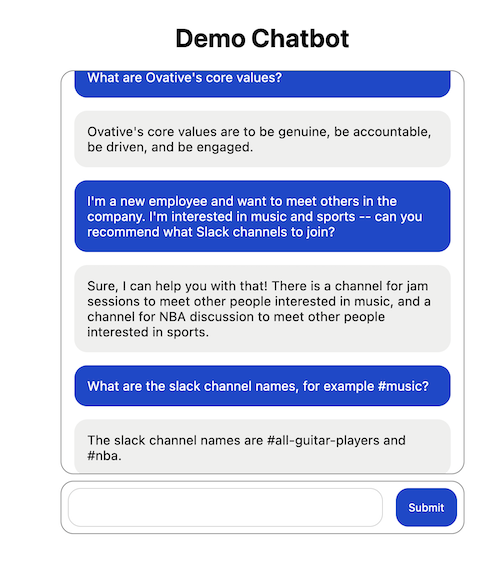

# Demo Chatbot

This application demonstrates how to use OpenAI, Langchain, Pinecone, and NextJS to build a
chatbot that can answer questions on your own documents based on augmented retrieval generation.

## Setup

1. Create an OpenAI account https://openai.com/
2. Create a free Pinecone database at https://www.pinecone.io/
3. Add a `.env` file to both `ingestion/` and `chatbot/` directories with the following values from OpenAI and Pinecone

```
OPENAI_API_KEY=""
PINECONE_API_KEY=""
PINECONE_ENVIRONMENT=""
PINECONE_INDEX_NAME=""
```

4. Add files to `ingestion/files/*` that will be loaded into the Pinecone database. Then run `cd ingestion && python app.py` to load them into your index
5. Run `npm install && npm run dev` in the `chatbot/` directory and visit `localhost:3000`


